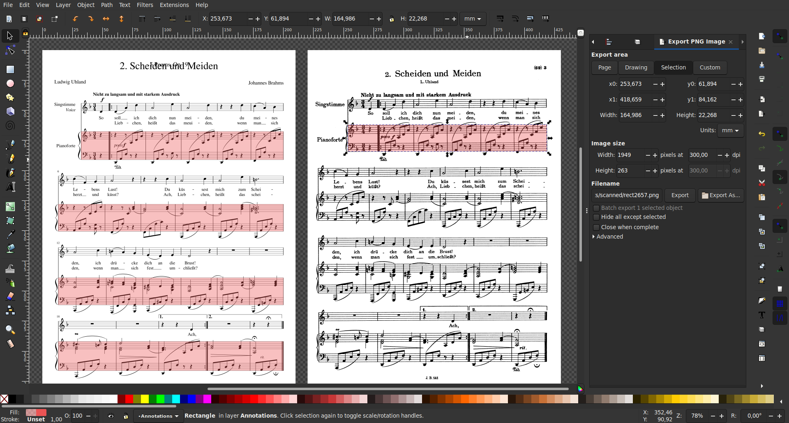

# OLiMPiC 1.0 dataset - an ICDAR 2024 Paper

This repository contains the source code for the article:

> **Practical End-to-End Optical Music Recognition for Pianoform Music**<br>
> (the article is yet to be published)

In which we:

1. Create a dataset of synthetic and scanned pianoform music for end-to-end OMR, called OLiMPiC. The dataset is built upon the [OpenScore Lieder Corpus](https://github.com/OpenScore/Lieder).
2. We introduce the LMX format (Linearized MusicXML) and define the linearization and delinearization procedures (see [MusicXML Linearization](#musicxml-linearization) section).
3. We train a baseline, state-of-the-art model called Zeus on this dataset (see [Zeus model](#zeus-model) and [TEDn evaluation metric](#tedn-evaluation-metric) sections).
4. We compare our dataset and model to the [GrandStaff dataset](https://link.springer.com/article/10.1007/s10032-023-00432-z).

If you want to start tinkering with the code, read the [After cloning](#after-cloning) section. If you build upon this work, read the [Acknowledgement](#acknowledgement) section.


## MusicXML Linearization

Linearized MusicXML is a sequential format convertible to and from MusicXML (with minimal losses), that can be used to train img2seq ML models. The conversions are implemented in the `app.linearization` module by classes `Linearizer` and `Delinearizer`. These classes are built to convert a single system (or a part when ignoring system breaks). But you can use the CLI wrapper instead:

```bash
# MusicXML -> LMX (accepts both XML and MXL)
python3 -m app.linearization linearize example.musicxml # produces example.lmx
python3 -m app.linearization linearize example.mxl # produces example.lmx
cat input.musicxml | python3 -m app.linearization linearize - # prints to stdout (only uncompressed XML input)

# LMX -> MusicXML (only uncompressed XML output available)
python3 -m app.linearization delinearize input.lmx # produces example.musicxml
cat input.lmx | python3 -m app.linearization delinearize - # prints to stdout
```

The `app.linearization.vocabulary` module defines all the LMX tokens.

To read more about the linearization process, see the [`docs/linearized-musicxml.md`](docs/linearized-musicxml.md) documentation file.


## Datasets

The final datasets can be downloaded from the [Releases page](https://github.com/ufal/olimpic-icdar24/releases) of this repository.

The module `app.datasets` contains submodules for building the individual datasets:

1. The `splits` module defines the train/dev/test splits for the OLiMPiC dataset
2. The `synthetic` module defines the synthetic-image OLiMPiC dataset (train, dev, test)
3. The `scanned` module defines the scanned-image OLiMPiC dataset (only dev and test)
4. The `grandstaff` module defines the Grandstaff-LMX extension for the GrandStaff dataset.

All modules export a CLI `__main__.py` to execute certain commands. To learn more about how these datasets are built, study the source code for the `build` command.

The exact OpenScore Lieder scores in the train/dev/test partitions are defined in `app.datasets.splits.data` folder and can also be imported as a python module.

The manual annotation process behind the `scanned` OLiMPiC dataset dataset was powered by Inkscape and CLI commands `load-workbench` and `save-workbench`. The first one creates a `workbench.svg` inkscape file, then the user annotates the bounding boxes, and then the second command consumes the file and updates corresponding dataset values.

Screenshot from the annotation process:




## Zeus model

Zeus is the OMR model for the OLiMPiC dataset. It is described and implemented in the [`zeus`](zeus) folder of this repository.


## TEDn evaluation metric

The module `app.evaluation` contains an implementation of the TEDn tree-edit-distance evaluation metric from the paper:

> **Further Steps towards a Standard Testbed for Optical Music Recognition**<br>
> Jan Hajič jr., Jiří Novotný, Pavel Pecina, Jaroslav Pokorný<br>
> 17th International Society for Music Information Retrieval Conference (ISMIR 2016)<br>
> https://s18798.pcdn.co/ismir2016/wp-content/uploads/sites/2294/2016/07/289_Paper.pdf

The file [`app.evaluation.TEDn`](app/evaluation/TEDn.py) implements the TEDn metric as a standalone python file with only the `zss` and `Levenshtein` dependencies, taking `xml.etree.ElementTree` elements as its inputs.

But in practise, you want to use (or at least understand) the [`TEDn_lmx_xml.py`](app/evaluation/TEDn_lmx_xml.py) file, as it exposes a nicer string-based API and contains the necessary canonicalization, pre-processing and post-processing needed. This function depends on the `app.linearization` and `app.symbolic` modules.

> **Note:** The TEDn metric is computationally expensive, so you need to do the evaluation system-wise. It will not compute the error for a whole score, since the time and memory complexity goes through the roof. Evaluation of one system (cca 4 measures) takes from 30 to 120 seconds. The evaluation time seems to grow cca quadratically with the size of the trees.


## After cloning

Setup Python venv (tested with python 3.8 and 3.10):

```bash
python3 -m venv .venv

.venv/bin/pip3 install --upgrade pip

# to run the linearization, dataset building, and evaluation
.venv/bin/pip3 install -r requirements.txt

# to run the Zeus model
.venv/bin/pip3 install -r zeus/requirements.txt
```

Install dependencies:

```bash
# (all of the installations are done locally within the repository)

# to be able to build the datasets yourself
make install-musescore
make install-open-score-lieder

# to just download the finished datasets
# (from this repo's releases page)
make install-olimpic-synthetic
make install-olimpic-scanned
make install-grandstaff-lmx
```


## Licenses

Datasets are available under CC BY-SA license.

- OLiMPiC synthetic
- OLiMPiC scanned
- GrandStaff-LMX (only the added `.lmx` and `.musicxml` files)

The trained Zeus model is available under CC BY-SA license (available for download in the releases page).

Source code in this repository is available under the MIT license.


## Acknowledgement

TODO: To be added once published.
